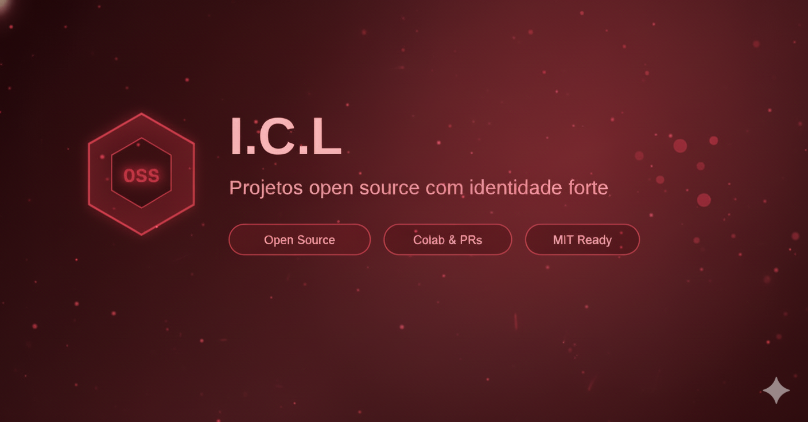

#

# 🧰 Dev Toolkit - Configuração opencode

Toolkit de desenvolvimento otimizado para **opencode** com configuração customizada, skills e guias de referência.


## Quick Start

```bash
npm install
```

## 🚀 Configuração Opencode

Este repo contém configuração completa para opencode com múltiplos modos de operação.

### Instalação da Configuração

Para usar esta configuração no seu PC:

```bash
# Copiar configuração para diretório global do opencode
cp -r .opencode/* ~/.config/opencode/

# Ou criar symlink (recomendado)
ln -sf $(pwd)/.opencode/opencode.json ~/.config/opencode/opencode.json
ln -sf $(pwd)/.opencode/prompts ~/.config/opencode/prompts
ln -sf $(pwd)/.opencode/skills ~/.config/opencode/skills
```

### Modos de Operação

| Comando | Descrição |
|---------|-----------|
| **Tab** | Cycle entre modos primary |

#### Modos Primary

| Modo | Descrição |
|------|-----------|
| **max** | Modo máximo - todas ferramentas, 100 iterações, modelo mais capaz |
| **build** | Desenvolvimento padrão com todas ferramentas |
| **light** | Respostas rápidas, mínimo de iterações (~10) |
| **plan** | Análise e planejamento SEM fazer mudanças |

#### Subagentes

| Agent | Descrição |
|-------|-----------|
| **@review** | Code review com checklist estruturado |
| **@debug** | Investigação de bugs |
| **@explore** | Exploração rápida do codebase |
| **@security-audit** | Auditoria de segurança |

### Skills Disponíveis

Use `skill({ name: "nome" })` para carregar:

| Skill | Descrição |
|-------|-----------|
| **code-review** | Checklist multi-dimensional com scoring de confiança |
| **feature-dev** | Workflow de 7 fases para desenvolvimento |
| **security-check** | Checklist de vulnerabilidades comuns |
| **commit-workflow** | Conventional commits e git workflow |
| **project-setup** | Setup de novos projetos Node/TS |
| **python-setup** | Setup de novos projetos Python |
| **python-dev** | Workflow de desenvolvimento Python |
| **go-setup** | Setup de novos projetos Go |
| **go-dev** | Workflow de desenvolvimento Go |

### Permissões

- Todas as ferramentas habilitadas por padrão (bash, edit, write, webfetch, etc)
- Execução automática sem pedir confirmação
- Sem restrições para comandos git

## 📂 Estrutura

```
.
├── .opencode/           # Configuração opencode
│   ├── opencode.json    # Agentes e permissões
│   ├── prompts/         # Prompts customizados
│   └── skills/          # Skills para opencode
├── docs/                📚 Guias de referência
├── skills/              🧠 Skills TypeScript (Node 24+)
├── plugins/             📖 Guias de referência (Claude Code)
├── scripts/             🔧 Scripts utilitários
└── package.json         Prometheus CLI
```

## 📚 Guias de Referência

| Guia                                         | Descrição                      |
| -------------------------------------------- | ------------------------------ |
| [Git Essentials](docs/git-essentials.md)     | Comandos Git do dia a dia      |
| [NPM Essentials](docs/npm-essentials.md)    | Manutenção de projetos Node.js |
| [Python Essentials](docs/python-essentials.md) | Comandos e ferramentas Python |
| [Ollama Setup](docs/ollama-setup.md)        | Modelos de IA local            |
| [Aider Setup](docs/aider-setup.md)          | Agente de coding via terminal  |
| [Cloud Models](docs/cloud-models.md)         | Gemini e Groq gratuitos        |
| [Docker Fundamentals](docs/docker-fundamentals.md) | Containers e Compose     |
| [GitHub Actions](docs/github-actions.md)     | CI/CD com GitHub Actions       |
| [Terminal Aliases](docs/terminal-aliases.md) | Atalhos de produtividade      |
| [DevContainer](docs/devcontainer.md)        | Ambientes isolados            |

## 🔧 Scripts

```bash
# Setup SSH para GitHub
bash scripts/setup-github-ssh.sh --user meu-user --email meu@email.com
```

## 📋 Prometheus (CLI)

```bash
npm run diagnosticar   # Análise de qualidade
npm run formatar       # Formatação automática
npm run scan          # Scan de licenças
npm run guardian      # Verificação de segurança
npm run test          # Executar testes
npm run security      # Scan de vulnerabilidades
```

## License

MIT-0


